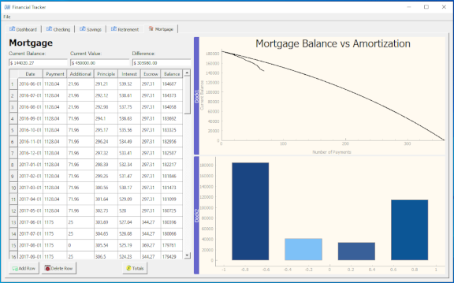

==========
finacial_tracker.py
==========

Author:
==========
CAM 

About:
==========
UI program written in Python and PyQt5 and uses SQLite for the backend database. 
The purpose is to create an application to track personal finances

Several files support the finacial_tracker program

- finacial_tracker.py 
	Main program
- layout.pptx (under files)
	Used for originial concept of the visual layout of the PyQt widgets
- create_db.py
	Used to create the database used for the finacial_tracker.py program
- read_db.py
	Used to review the database ensuring that it was created correctly

Usage:
==========
Simply run the program. 

Development:
===========
The Finacaial Tracking program has the following features:

Still in development

Notes:
==========
None

Screen Shots:
==========
