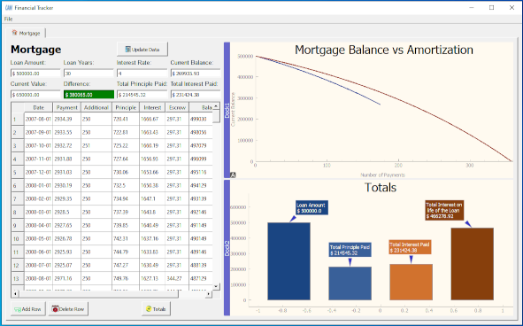

==========
mortgage_tracker.py
==========

Author:
==========
CAM 

About:
==========
UI program written in Python and PyQt5 and uses SQLite for the backend database. 
The purpose is to create an application to track the users mortgage balance

Several files support the mortgage_tracker program

- mortgage_tracker.py 
	Main program
- layout.pptx (under files)
	Used for originial concept of the visual layout of the PyQt widgets
- create_db.py
	Used to create the database used for the motgage_tracker.py program
- read_db.py
	Used to review the database ensuring that it was created correctly

Usage:
==========
Run the program. Every month that the user pays their mortgage, they can track thier progress
in the tracker. The program has many featurs to include; tracking the original balance of the loan, 
the current loan balance, the total principle paid, and the totla interest paid. The data is also presented
is graphical form, such as a line chart showing the mortgage balance over time and bar graphs for comparision
of the important items such as the loan amount versus the total interest paid to dat.

Development:
===========
The Mortgage Tracking program features a SQLite database for the data backend and uses 
PyCharts to graph the progress of the mortgage balance

Notes:
==========
None

Screen Shots:
==========

