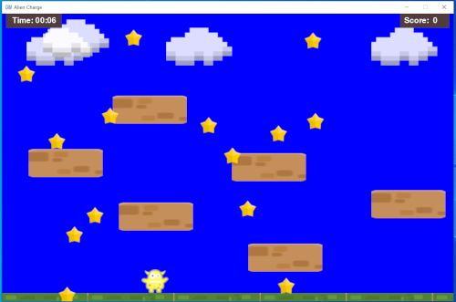

==========
alien_charge.py
==========

Author:
==========
CAM 

About:
==========
Simple one level platformer game using pygame as the game engine. Platforms are placed using a static coordinate system. The randomly placed stars collected provide points.Points and time displayed at the top of the screen

Usage:
==========
Simply run the program. 

Development:
===========
None

Notes:
==========
None

Screen Shots:
==========

