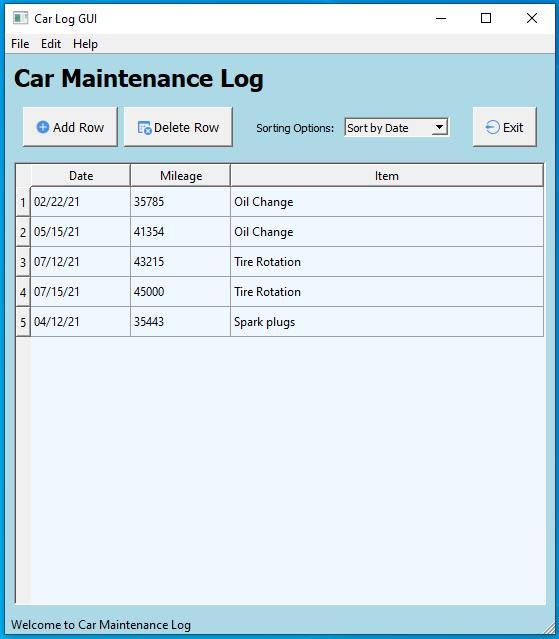

==========
car_maintenance_log.py
==========

Authors:
==========
CAM 

About:
==========
Simple UI program written in Python and PyQt5 and uses SQLite for the database. 
The purpose is to create an application to track car maintenance performed while
showing Python programing skills

Several files support the car_maintenance_log program

- car_log_layout.pptx
	Used for originial concept of the layout of the application widgets
- create_car_log_database.py
	Used to create the database used for the car_maintenance_log program
- read_car_log_db.py
	Used to review the database ensuring that it was created correctly

Usage:
==========
Simply run the program. 

Development:
===========
The car maintenance program has the following features:

- Menu - (PyQt5 menuBar) Dropdown menus with "File", "Menu", and "Help"
- Add Row - (PyQt5 QPushButton) Allows the user to add a row that can be populated
- Delete Row - (PyQt5 QPushButton) Allows the user to delete any row
- Sorting Options - (PyQt5 QComboBox) Aloows the user to sort by "Date", "Mileage", or "Item"
- Exit - (PyQt5 QPushButton)Prompts the user if they want to exit or not, if "Yes" db table will be saved
- Message Bar - (PyQt5 statusBar) Message welcoming the user to the Car Maintenance Log program

Notes:
==========
None

Screen Shot:
============

